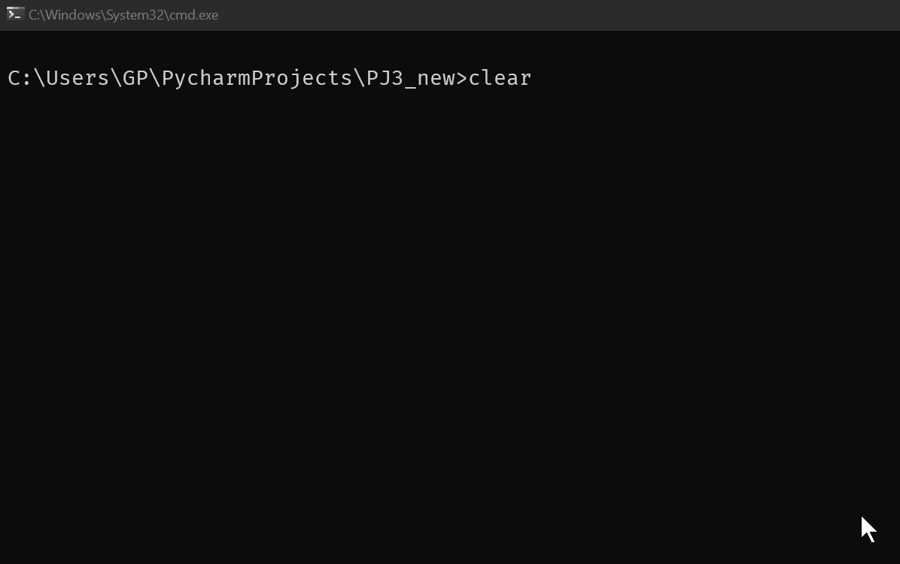
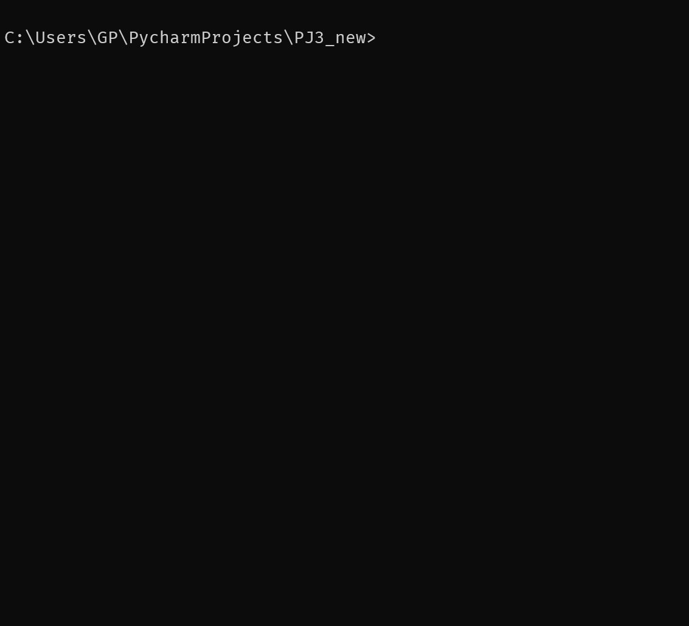
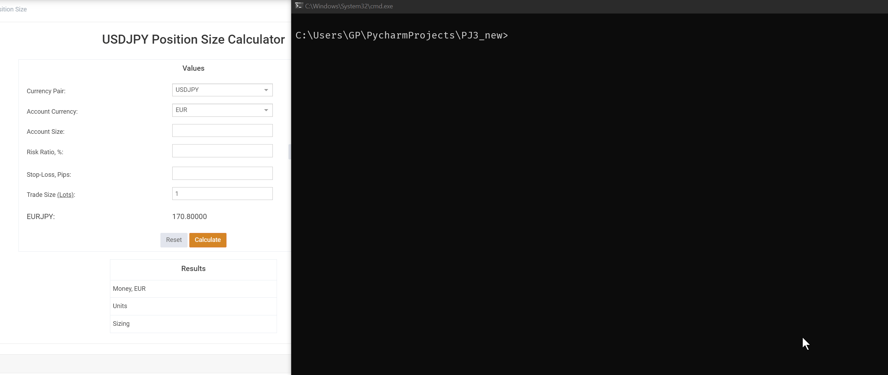
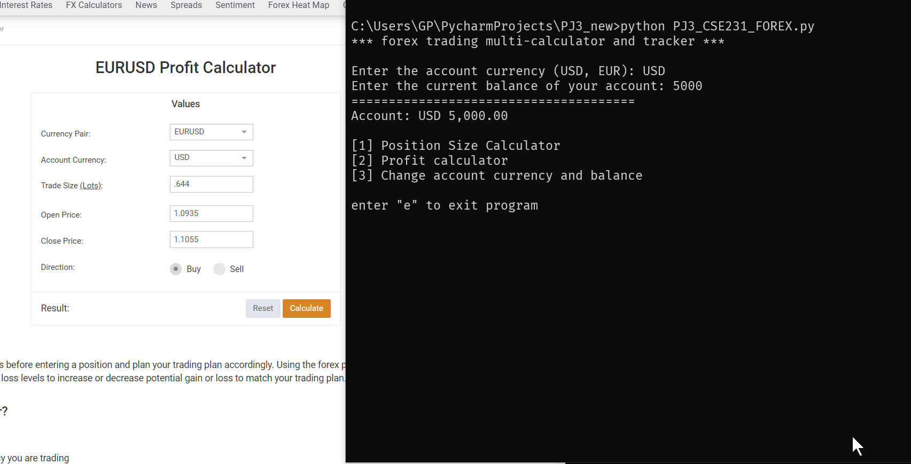
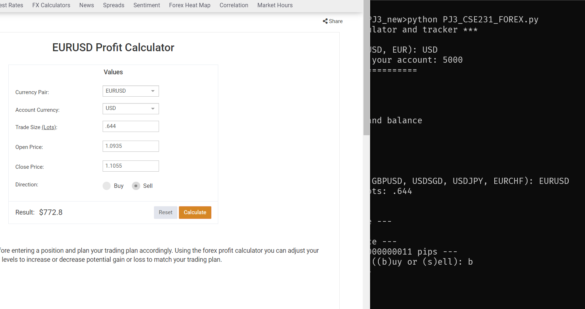

# READ ME IS WORK IN PROGRESS (JUL 17, 2024, 19:58)

## Prologue; What is forex?


# Objectives of this project:

Learn to handle scrubbing dirty input, do currency conversions using abstract units of measurments (pips and lots)

This project mainly relies on the comprehension of loops, conditional statements, and fstrings. \
(There is a use of "eval" which may be innaproriate for this project, if so, lines 166 and 225 need to be re-thought out)

The goal of this readme is to breakdown the project into modules. **The code of this project is 240 lines**\
where the instructor code for old project 3 is about 170. I will leave it upto whom ever has the final say\
to add, remove or reconfigure, modules from to this project in order to craft a more suited project 3 for CSE231. 

## Project breakdown

- ### Setting up the users account

Lines: 73 -> 126, 152 -> 154 \
Total: **55 lines**



On every run of the program, the user will be asked to input a currency, either USD or EUR, and an amount. \
Both the account currency type, and currency amount input have error checking implemented.
This will represent how much money the user is working with and all calculation in the program will rely on it.\
The user also has the option to change their currency and amount on the fly with a menu option (option 3).

When selecting menu 3, we are presented with a prompt to either pick a new currency, or just press enter for\
the default entry. There is error checking implemented here as well.



- ### Menu option 1, calculating position size

Lines: 206 -> 234, (relies on (10) lines 136 -> 146 for calculating pip value)\
Total: **28 lines**

On the left is an [online currency calculator](https://www.myfxbook.com/forex-calculators/position-size/USDJPY), plugged into API's that constantly get updated forex rates.\
On the right is the python program with a set of static values set at the top of the program,\
*which is why there may be a small discrepancy between the two, but the math will always return similar results.*

DEMO


**Definitions:**

- **Account Currency** will be what currency our broker is accepting, This currency would appear in our trading account to use as leverage for trading. So if we are in the USA, we will be using USD.
- **Currency Pair** is the pair of currency we are treating as an asset (like one would treat TSLA in the stock market) to execute our trades against.
- **Account size** is the amount of money we have in our trading account to use as leverage for trades.
- **Risk ratio** is simply the percent amount of our account size we are willing to lose on one trade. Typically 2-5%
- **Stop-Loss in pips** every point the market moves in forex is called a pip, if the market moves 50 pips on EUR/USD, An example of the market value of EUR/USD could have moved from 1.0850 to 1.0900 where one pip is one digit in the fourth decimal place, or one ten thousandth of a currency pair value \
*(this is not true for one exception, any pair with the japanese yen, where we measure one pip in the 100th's place, 161.54 to 161.64 is a 10 pip movement)* [further explanation on pips can be found below](#explaining-pips)
- **Trade size** - in the online calculator, trade size is just a reference for how big of lots we are trading in, standard lot sizes are 1.0, so we will keep it as one. [further explanation on lots can be found below](#explaining-lot-sizes)

**Calculation**

### The calculation for position size can be found on line 228
```python
position_size = (((account_balance * risk_percent)/pip_stoploss)/pip_value_per_lot)
```
position size relies on four values, three of which the user gives to us (acc balance, risk percent of acc, and pip stoploss) the fourth value requires some calculation which is done on the code block on lines 136 to 146\
```python
    if account_currency == "USD":
        pip_value_per_lot_USD = STANDARD_PIP * STANDARD_LOT_SIZE
        pip_value_per_lot_SGD = (STANDARD_PIP / USDSGD) * STANDARD_LOT_SIZE
        pip_value_per_lot_JPY = (JPY_PIP / USDJPY) * STANDARD_LOT_SIZE
        pip_value_per_lot_CHF = (STANDARD_PIP / USDCHF) * STANDARD_LOT_SIZE
    elif account_currency == "EUR":
        pip_value_per_lot_EUR = STANDARD_PIP * STANDARD_LOT_SIZE
        pip_value_per_lot_SGD = (STANDARD_PIP / EURSGD) * STANDARD_LOT_SIZE
        pip_value_per_lot_JPY = (JPY_PIP / EURJPY) * STANDARD_LOT_SIZE
        pip_value_per_lot_CHF = (STANDARD_PIP / EURCHF) * STANDARD_LOT_SIZE
        pip_value_per_lot_USD = (STANDARD_PIP / EURUSD) * STANDARD_LOT_SIZE
```
An example (and online explanation) of a pip value per lot calculator can be found [online here](https://www.myfxbook.com/forex-calculators/pip-calculator)

The value of a pip depends on our account currency. In this case, either USD or EUR. 

A pip is calculated by the following: (1 pip / Quote currency Exchange Rate to Account Currency) * lot size measurement\
*In every currency pair, there is a base currency and a quote currency.\
In EUR/USD, the EUR is the base currency and the USD is the quote currency.*

In this case, A standard pip will always be 0.0001, only unless the jpy is involved.\
For a trading account that uses USD, where the **quote currency is the USD** (eg EURUSD), the pip value per lot in this case will be $10 (or `(0.0001 / 1) * 100,000`)\
Where a "standard lot" is **100,000 units of the base currency**.

Here is some video explanations on the subject which helped create this project:\
Video 1: https://www.youtube.com/watch?v=7kzizI2MpfA \
Video 2: https://www.youtube.com/watch?v=omPNkM7PdQ4&t \
Video 3: https://www.youtube.com/watch?v=3jwixTmgHUg

[more about position size can be found here](https://learningcenter.fxstreet.com/education/learning-center/unit-3/chapter-3/the-position-size/index.html)

- ### Menu option 2, calculating profits
An easier implementation than menu 1, but still requires the pip_value_per_lot code block mentioned just above.

**Going long** (or entering a buy position): if you're going long, you buy the currency pair when its low, say 1.1, and hope it goes to 1.2 to make a profit, if it goes to 1.0, then you lost money.

**Going short** (or entering a sell position): if you're going short, you're buying a currency pair at what you think is the peak, hoping that the pair devalues which you will profit from. 1.1 -> 1.0 = profit, where 1.1 -> 1.2 on a short position = loss. 

DEMO (going long)


DEMO (going short)


[online profit calculator used with explanation](https://www.myfxbook.com/forex-calculators/profit-calculator/EURUSD)

This calculation is straitforward. Its important to know the currency pair the user is trading, and their account currency. This will obtain a pip value per lot.\
Lot size is a standard 100,000 units of base currency per 1 lot, and the pip value per lot is calculated on lines 136 to 146 as explained [just above](#the-calculation-for-position-size-can-be-found-on-line-228)

**notes**
Take extra care to make sure if a JPY currency is involved, to calculate pips differently such as shown in line 177
```python
    if "JPY" in currency_pair:
        pip_delta = (close_price - open_price) * 100
    else:
        pip_delta = (close_price - open_price) * 10000
```


Line 194 contains the formula:
```python
profit = trade_size_in_lots * pip_value_per_lot * pip_delta
```

Where trade size in lots is given by the user, pip value per lot is obtained from the users account currency, and calculations done on line 136-146.
Pip delta is the different between the price of the currency pair from the time of entering a position (open price), and price of exiting the position (close price). \
This will determine the users specific pip count lost or gained between the open and closing position.

On line 196 the following code snippet just inverts the profit/loss if the user entered a sell, or short position.
*as would indicate a profit if the currency pair devalued from 1.1 to 1.0, where a normal buy position would define a loss on that evaluation.
```python
    if trade_direction == "s":
        profit = profit * -1
```

### explaining pips

Pip stands for percentage in points. When you look up a currency pair on the forex market you will always see it to the fourth or fifth decimal place.\
Technically the fourth decimal place is the pip, and the fifth decimal place not all brokers support, but is called a *pipette* and is one tenth of a pip.

An important side note about pips, with any pair with the japanese yen as the quote currency (eg USD/JPY)\
*quote currency being the second currency in the pair, base being the first*
The pip of such a currency pair will only be measured to the hundredths place, example USDJPY = 156.29 \
If this pair was to increase to 156.30 then this would be an observed rise in one pip.\
Same rules about pipettes apply to the JPY currencies, where the pipette is the next place after the decimal, or the third digit in this case if a broker supports it on their trading platform.

Two short videos explaining pips:
Video 1: https://www.youtube.com/watch?v=EfGmUiOPJCA
Video 2: https://www.youtube.com/watch?v=D1YjpXDAG-c

### explaining lot sizes